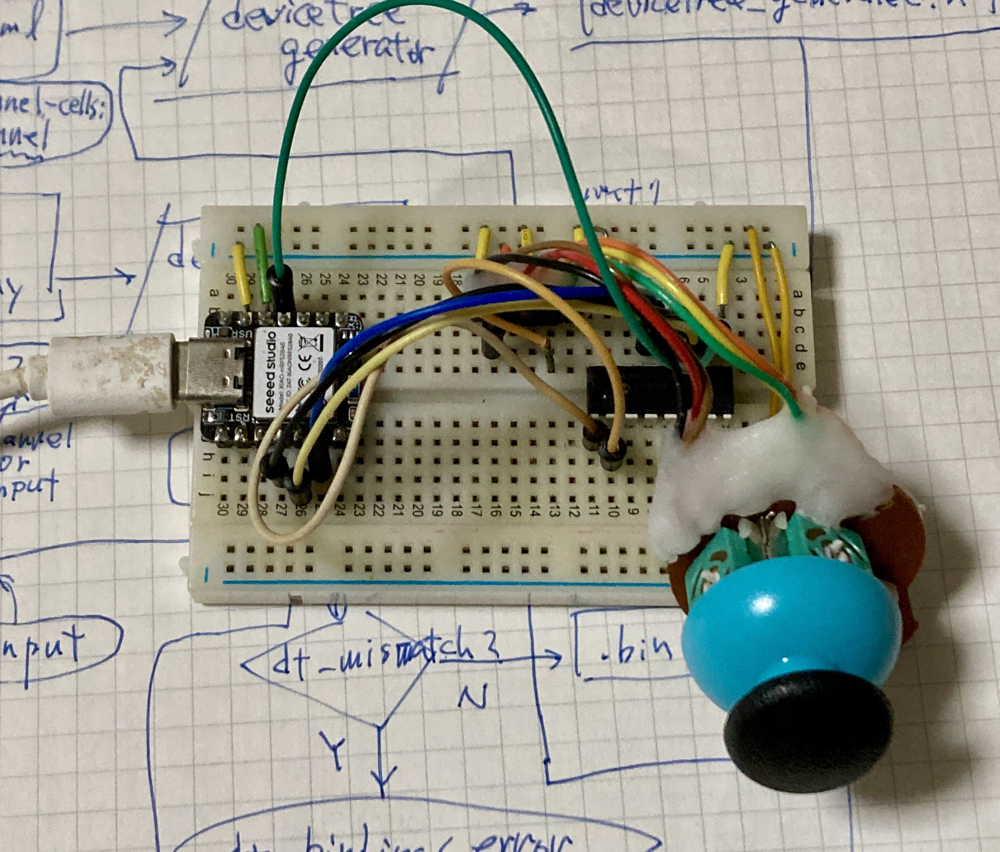
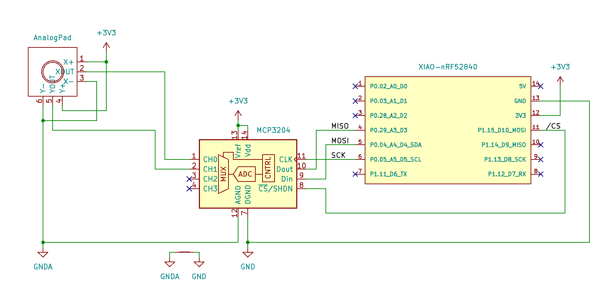
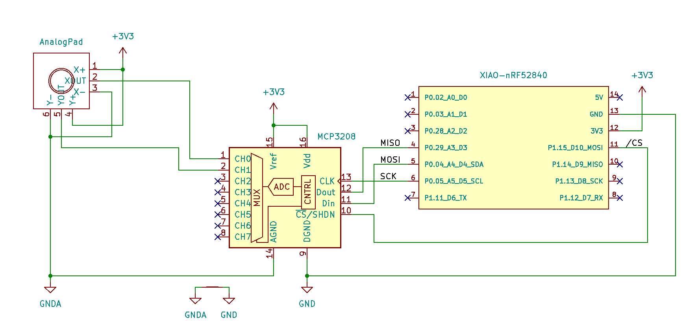

# ZMK sample shield for analog-input-driver with mcp320x



This zmk-config shows how to use [MCP320x](https://www.microchip.com/en-us/product/mcp3204) with [zmk-analog-input-driver](https://github.com/badjeff/zmk-analog-input-driver).

- board: seeeduino_xiao_ble (XIAO nRF52840)
- shield: analog-input-mcp320x
- modules: https://github.com/hidsh/zmk-analog-input-driver (branch: "support-mcp320x")

## Firmware Binary
You can download `zmk.uf2` from the [Releases](https://github.com/hidsh/zmk-analog-input-mcp320x/releases).

## Connection
### MCP3204


### MCP3208


## Configs and DTS(`.overlay`)
You can copy-n-paste the snippet below when you create your own keyboard, but there are some points of attention.
And your configs/dts can be used to both MCP3204 and MCP3208 without any modifications, because of their wiring.

### YOUR-SHIELD.conf
https://github.com/hidsh/zmk-analog-input-mcp320x/blob/58f350d72296df8160907d814c6e069b578c131a/boards/shields/analog-input-mcp320x/analog-input-mcp320x.conf#L8-L34

Note: The following configs are used when you [adjust](#Adjust) your thumb sticks.
- `CONFIG_ANALOG_INPUT_LOG_LEVEL_DBG`
- `CONFIG_ANALOG_INPUT_LOG_DBG_RAW=y`
- `CONFIG_ANALOG_INPUT_LOG_DBG_REPORT`

Not tested:
- `CONFIG_ADC_ASYNC` 


### YOUR-SHIELD.overlay
https://github.com/hidsh/zmk-analog-input-mcp320x/blob/58f350d72296df8160907d814c6e069b578c131a/boards/shields/analog-input-mcp320x/analog-input-mcp320x.overlay#L36-L135

Notes:
- `&pinctrl {..}` is *not* mandatory if you use default pinout.
- `spi-max-frequency` shoud be in the range 200kHz .. 1MHz.
- `adc-mcp320x-vref-mv` shoud be set proper value followed by the connection of the `Vref` pin.
- `mv-mid`, `mv-min-max`, `mv-deadzone` shoud be set proper values by hand-adjusting. See [Adjusting](#Adjusting).

Not tested:
- `report-on-change-only` 

## Local Build
### Prerequisites
- ZMK [Native Setup](https://zmk.dev/docs/development/local-toolchain/setup/native)
- [cyme](https://github.com/tuna-f1sh/cyme) (for flashing firmware)

### Setup
```
# clone this repo
cd ~/Downloads
git clone --recursive -b support-mcp320x https://github.com/hidsh/zmk-analog-input-driver.git

# cd to your `zmk/app` folder
cd PATH/TO/zmk/app

# create a symlink from a makefile
ln -s ~/Downloads/zmk-analog-input-mcp320x.mk ./Makefile
```

### Build
```
cd PATH/TO/zmk/app

# just `make` to build/flash firmware
make
```

Note: `zmk.uf2` will be found under the `PATH/TO/zmk/app/build/zephyr/`.

## Adjusting Steps
You find the appropriate values for the propertes below:
|Property|What the he..|
|---:|:---|
|`mv-mid`| Center |
|`mv-min-max`| Range |
|`mv-deadzone`| Deadzone |
|`scale-multiplier`| Spped up|
|`scale-divisor`|Slow down|

The following steps shows my personal method. Though it's not reliable at all, it might still be a stepping stone for you. 

### 1. Use `usb-logging`
You enable the following configs in YOUR-SHIELD.conf.
```
CONFIG_ANALOG_INPUT_LOG_LEVEL_DBG=y
CONFIG_ANALOG_INPUT_LOG_DBG_RAW=y
CONFIG_ANALOG_INPUT_LOG_DBG_REPORT=y
```
And then rebuild with `--snippet zmk-usb-logging`.

BTW, you can find the argument in the [Makefile](https://github.com/hidsh/zmk-analog-input-mcp320x/blob/58f350d72296df8160907d814c6e069b578c131a/analog-input-mcp320x.mk#L20). 
```
OPT_USB_LOGGING = --snippet zmk-usb-logging
```
At this time, you flash the new firmware.

you can use [tio](https://github.com/tio/tio) to look something from `usb-logging` as below.
```
tio /dev/ttyACM0

[00:00:02.280,639] <dbg> ANALOG_INPUT: analog_input_report_data: AIN0 raw: 2142 mv: 10354
[00:00:02.280,670] <dbg> ANALOG_INPUT: analog_input_report_data: AIN1 raw: 2092 mv: 10112
[00:00:02.290,649] <dbg> ANALOG_INPUT: analog_input_report_data: AIN0 raw: 2142 mv: 10354
[00:00:02.290,679] <dbg> ANALOG_INPUT: analog_input_report_data: AIN1 raw: 2092 mv: 10112
[00:00:02.300,659] <dbg> ANALOG_INPUT: analog_input_report_data: AIN0 raw: 2142 mv: 10354
       :
```
In this log, `AIN0` means `x-ch` in your `.overlay` and the `AIN1` means `y-ch`. but it may hard to look a little because it alternately shows both `AIN0` and `AIN1`.
it might be better than before to use [myfilter.py](https://gist.github.com/hidsh/a3ee73315be6d654c0cc74f553d0c1a9) as below:
```
tio /dev/ttyACM0 | myfilter -x AIN1      # Ignore lines include 'AIN1'
[00:20:41.559,692] <dbg> ANALOG_INPUT: analog_input_report_data: AIN0 raw: 2142 mv: 10354
[00:20:41.569,793] <dbg> ANALOG_INPUT: analog_input_report_data: AIN0 raw: 2143 mv: 10359
[00:20:41.579,742] <dbg> ANALOG_INPUT: analog_input_report_data: AIN0 raw: 2142 mv: 10354
[00:20:41.589,721] <dbg> ANALOG_INPUT: analog_input_report_data: AIN0 raw: 2142 mv: 10354
[00:20:41.599,731] <dbg> ANALOG_INPUT: analog_input_report_data: AIN0 raw: 2140 mv: 10344
       :
```
Of cource, you can do this for `ch-y` using `myfilter -x AIN0` instead.

### 2. Take notes
You pick the following values and take notes of them:
- Minimum/Maximum values while a stick neutral as "zero"
- Maximum value when the stick pushes top edge as "max"
- Minimum value when the stick pushes bottom edge as "min"

### 3. Believe your math
To begin with `mv-mid`.
Then you replace the value of the parameter with "zero" value in your `.overlay`.
At this time, you do rebuild and flash the new firmware.
Your new firmware might behave better than before.
You iterate this work for each property.

Second property `mv-min-max` wants your answer to `((max - min) / 2) * 0.9)`. The `0.9` means some margin.

### 4. Follow your sense
The rest of the properties require something like sense instead of mathematics.

Therefore, I'd like to quote a master of martial arts.

> Don't think, feel!

Enjoy!

## Links
- Patched Driver for MCP320x: [zmk-analog-input-driver (branch: "support-mcp320x")](https://github.com/hidsh/zmk-analog-input-driver/tree/support-mcp320x)
- Original Driver: [zmk-analog-input-driver](https://github.com/badjeff/zmk-analog-input-driver). Thanks to [badjeff](https://github.com/badjeff)!
- [Zephyr Official Document/MCP3204](https://docs.zephyrproject.org/latest/build/dts/api/bindings/adc/microchip%2Cmcp3204.html)
- MCP320X Device Driver (Zephyr built-in):
  - [`zephyr/drivers/adc/adc_mcp320x.c`](https://github.com/zephyrproject-rtos/zephyr/blob/main/drivers/adc/adc_mcp320x.c)
  - [`zephyr/drivers/adc/Kconfig.mcp320x`](https://github.com/zephyrproject-rtos/zephyr/blob/main/drivers/adc/Kconfig.mcp320x)
